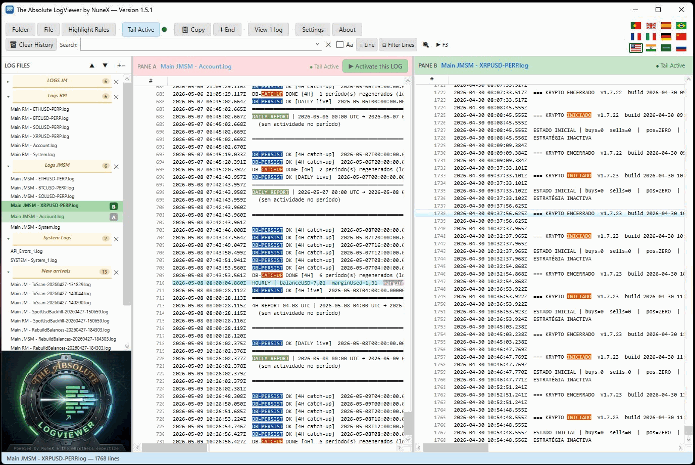

# The Absolute LogViewer

**Everything you wish `tail -f` had — on Windows.**
Real-time tailing, independent tabs, split-pane compare, regex highlight rules and context preview.

[**⬇ Install (ClickOnce)**](https://nunex-mbrothers.github.io/TheAbsoluteLogViewer/) · [**Standalone .exe**](https://github.com/NuneX-mBrothers/TheAbsoluteLogViewer/releases/latest/download/LogViewer.exe) · [**Portable .exe**](https://github.com/NuneX-mBrothers/TheAbsoluteLogViewer/releases/latest/download/LogViewerPortable.exe) · [**Website**](https://nunex-mbrothers.github.io/TheAbsoluteLogViewer/)

Free · .NET 10 / WPF · 12 languages · SHA-256 verified downloads

---

## What it does

- **Real-time tailing** — follow `.log` files live; new lines stream in instantly. Scroll up to pause, hit the bottom to resume.
- **Independent tabs** — each tab is its own workspace, with its own logs, split, search and ordering. Watch separate projects at once.
- **Split-pane compare** — two files side by side, each with its own search and tail.
- **Tail `.csv` in columns** — `.csv`/`.tsv` render as a table; the header becomes the column titles and new rows appear live.
- **Regex highlight rules** — colour whole lines or single words, with word-boundary helpers and a live preview.
- **Context preview** — hover a filtered line to peek at the surrounding lines from the full, unfiltered file.
- **Built-in auto-update** — Standalone and Portable update themselves, integrity-checked over HTTPS.
- **12 languages**, switched instantly, no restart.

## Editions

| Edition | Install | Size | Requirements |
|---|---|---|---|
| **ClickOnce** | from the [website](https://nunex-mbrothers.github.io/TheAbsoluteLogViewer/) | ~5 MB | Microsoft Edge · auto-updates via Windows |
| **Standalone** | [`LogViewer.exe`](https://github.com/NuneX-mBrothers/TheAbsoluteLogViewer/releases/latest/download/LogViewer.exe) | ~1.3 MB | [.NET 10 Desktop Runtime](https://dotnet.microsoft.com/download/dotnet/10.0/runtime) |
| **Portable** | [`LogViewerPortable.exe`](https://github.com/NuneX-mBrothers/TheAbsoluteLogViewer/releases/latest/download/LogViewerPortable.exe) | ~158 MB | none — self-contained |

Blocked from downloading `.exe` files? Each edition also ships as a `.zip` in the same release.

## First run

The executable isn't code-signed yet, so Windows SmartScreen may warn on first launch.
Click **More info → Run anyway**. Every release publishes its **SHA-256**, and the app verifies it
before installing any update over HTTPS — tampered binaries are rejected automatically.

Independently verified: tested in **Softpedia Labs** and awarded
[**100% Clean**](https://www.softpedia.com/get/Programming/Other-Programming-Files/The-Absolute-LogViewer.shtml#status)
— no spyware, adware or viruses.

## About this repository

This is the **public distribution repository**: it hosts the landing page (GitHub Pages), the
ClickOnce manifests and the release artifacts. **The source code is not public.**

Bug reports and feature requests are very welcome via
[Issues](https://github.com/NuneX-mBrothers/TheAbsoluteLogViewer/issues). Pull requests aren't
accepted, since the source lives elsewhere.

**Freeware** — free for personal and commercial use.

## About

Made by **mBrothers** — three brothers who keep talking each other into building things.
Questions and ideas: [NunexmBrothers@gmail.com](mailto:NunexmBrothers@gmail.com)

Also from us: [**ExplorerFocus**](https://nunex-mbrothers.github.io/ExplorerFocus/) — a distraction-free file explorer for Windows.

© 2026 mBrothers
